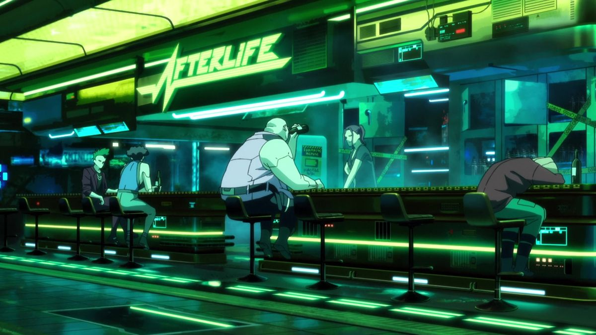

#### Hey there, I'm Matteo 👋

A 20 year old CS student specializing in Infrastructure. I focus on **Networking, Wireless Communication and Software Systems**

📃 I'm currently learning:

  
  
  
  
  
  
  
  

⭐ Some projects that I'm working on:

- [Personal Portfolio](https://gradinaru.net/)
- [HealTest - Network Chaos Platform (Alpha)](https://healtest.dev/)

 

  

